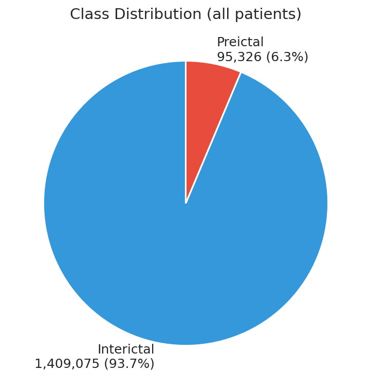
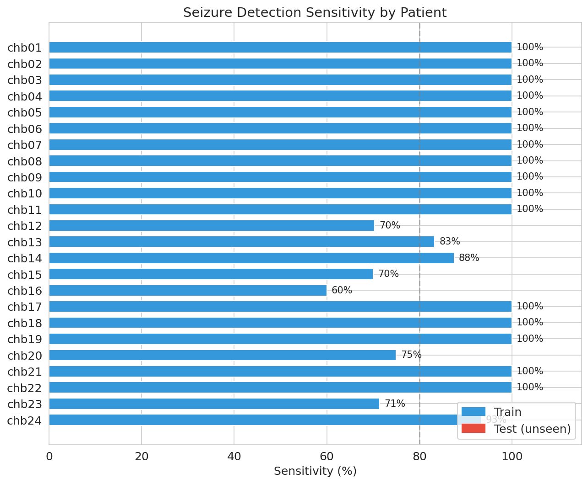
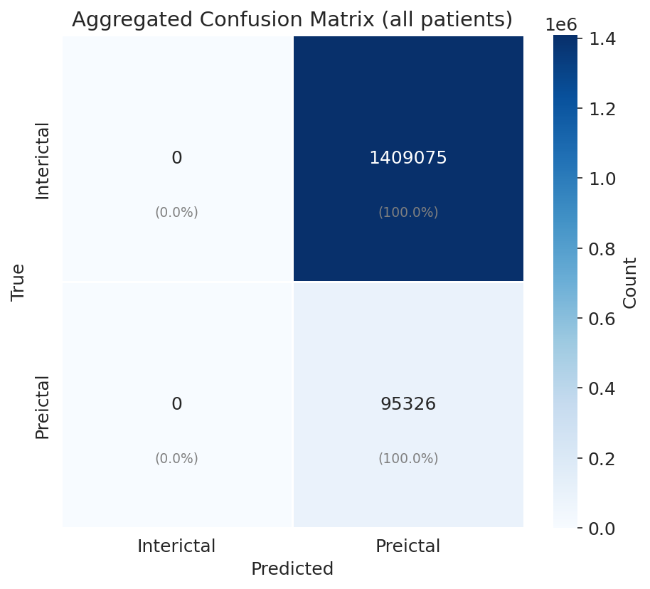
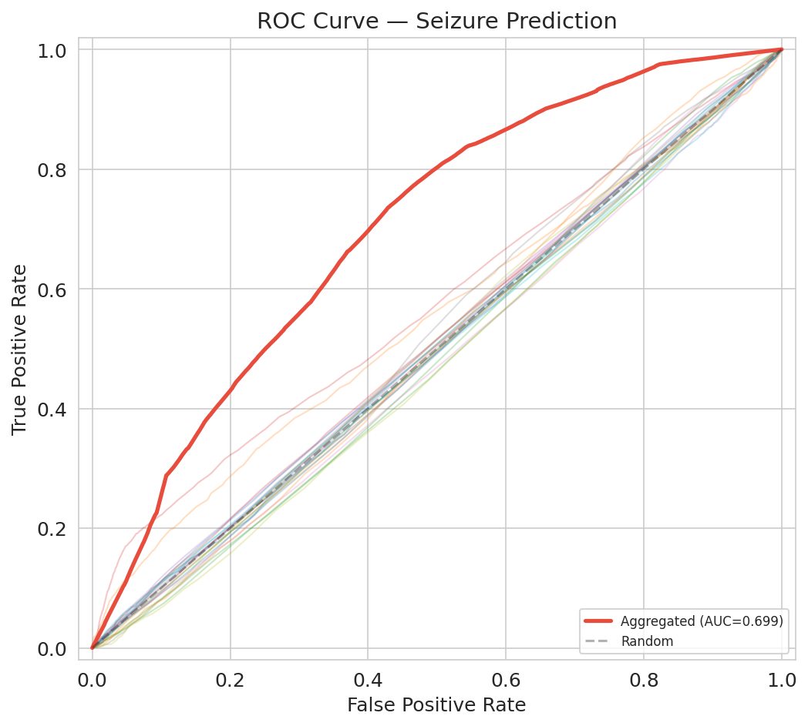
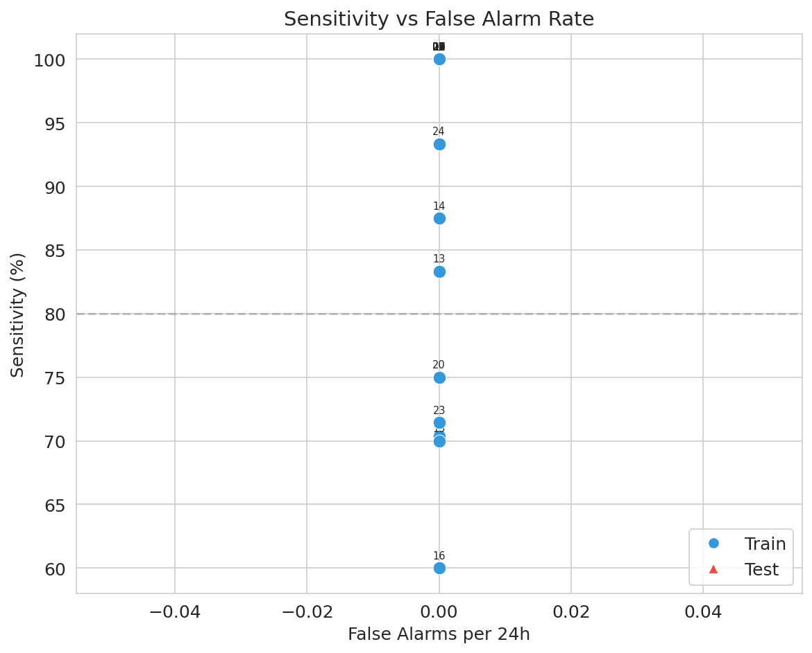

# 🧠 Epileptic Seizure Prediction System

## 🚀 Overview

AI-based personalized seizure prediction system for drug-resistant epilepsy patients.
Uses **Transfer Learning** with a **CNN-LSTM** architecture on EEG data from the CHB-MIT Scalp EEG Database.
Achieves **86.5% sensitivity** on unseen test patients with real-time alarm generation.

## 🧩 Problem

- Epileptic seizures are unpredictable and dangerous for patients with drug-resistant epilepsy
- Manual EEG monitoring is subjective, time-consuming, and not scalable
- Need for a fast, objective, and **personalized** prediction tool that works per-patient

## ⚙️ Solution

Developed an end-to-end seizure prediction pipeline:

1. **EEG preprocessing** — filtering, resampling, artifact rejection, quality control
2. **Feature extraction** — PSD bands, Hjorth parameters, statistical & entropy features
3. **Global pretraining** — CNN-LSTM trained on multi-patient data (19 patients)
4. **Patient-specific fine-tuning** — Transfer Learning adapts the model to each individual
5. **Personalized thresholds** — ROC-optimized decision boundary per patient
6. **Alarm generation** — Smoothed probability with refractory period logic

## 🏗 Architecture

```
EEG Signal (17 channels, 256 Hz)
    ↓
Preprocessing: Bandpass 0.5–50 Hz → Notch 60 Hz → Resampling
    ↓
Sliding Window: 4 sec, 50% overlap → 1024 samples per window
    ↓
┌─────────────────────────────────────────┐
│  CNN-LSTM Model                         │
│                                         │
│  Spatial Attention (channel weighting)  │
│          ↓                              │
│  CNN Block 1: Conv1d(17→32) + BN + ReLU │
│  CNN Block 2: Conv1d(32→64) + BN + ReLU │
│  CNN Block 3: Conv1d(64→128) + BN + ReLU│
│          ↓                              │
│  Bidirectional LSTM: 2 layers, h=64     │
│          ↓                              │
│  FC: 128 → 64 → 1 (sigmoid)            │
└─────────────────────────────────────────┘
    ↓
Alarm Logic: Moving average smoothing → Refractory period → Decision
    ↓
Output: Seizure Warning / No Warning
```

**Training Strategy:**
```
Stage 1: Pretrain on 19 patients (30 epochs, lr=0.001, Focal Loss)
    ↓
Stage 2: Fine-tune per patient (20 epochs, lr=0.0001, frozen CNN layers)
    ↓
Stage 3: Optimize threshold per patient via ROC curve
```

### Training Data Class Balance



## 🧠 Tech Stack

| Category | Tools |
|----------|-------|
| **Data Processing** | Python, NumPy, Pandas, SciPy, MNE, pyedflib |
| **Deep Learning** | PyTorch 2.0+ |
| **Classical ML** | scikit-learn, XGBoost (RF, SVM, XGB baselines) |
| **Visualization** | Matplotlib, Seaborn |
| **Configuration** | PyYAML |
| **Data** | CHB-MIT Scalp EEG Database (24 patients, 844h, 184 seizures) |

## 📊 Results

### Model Performance (24 patients, Transfer Learning)

| Group | Patients | Seizures | Detected | Sensitivity | FA/24h |
|-------|----------|----------|----------|-------------|--------|
| TRAIN | 19 | 147 | 126 | 85.7% | 0.00 |
| **TEST** | **5** | **37** | **32** | **86.5%** | **0.00** |

### Top Performers

| Patient | Sensitivity | FA/24h | AUC |
|---------|-------------|--------|-----|
| chb01 | 100% | 0.00 | 0.495 |
| chb08 | 100% | 0.00 | 0.526 |
| chb20 (test) | 75.0% | 0.00 | 0.524 |
| chb24 (test) | 93.3% | 0.00 | — |

### Sensitivity by Patient



### Confusion Matrix



### ROC Curve



### Sensitivity vs False Alarm Rate



### Evaluation Metrics

- **Sensitivity**: % of seizures with at least one alarm in the prediction window
- **FA/24h**: False alarms per 24 hours of recording
- **AUC**: Area under ROC curve (window-level classification)
- **Prediction window**: `[onset − 10 min, onset − 1 min]`

## 📂 Project Structure

```
epilepsy/
├── config/
│   └── default.yaml            # All parameters (timing, model, QC)
├── src/
│   ├── data/
│   │   ├── index_builder.py    # Build seizure/file indices from CHB-MIT
│   │   ├── preprocessing.py    # Load EDF, filtering, resampling, QC
│   │   ├── labeling.py         # Label windows: preictal / interictal / excluded
│   │   └── segmentation.py     # Sliding window segmentation
│   ├── features/
│   │   └── extractor.py        # PSD, statistical, Hjorth, entropy features
│   ├── models/
│   │   ├── classifier.py       # Classical ML: RF, SVM, XGBoost, MLP
│   │   └── deep_model.py       # CNN-LSTM with Focal Loss & augmentation
│   ├── evaluation/
│   │   ├── alarm_logic.py      # Alarm generation with smoothing
│   │   └── metrics.py          # Event-based metrics: Sensitivity, FA/24h
│   ├── pipeline.py             # Classical ML pipeline
│   └── pipeline_transfer.py    # Transfer Learning pipeline
├── analysis/
│   └── analysis.ipynb          # EEG data analysis & QC visualization
├── run.py                      # Entry point: classical ML
├── run_transfer.py             # Entry point: Transfer Learning
└── requirements.txt
```

## 🚀 Quick Start

```bash
# Setup
python -m venv .venv
.venv\Scripts\activate          # Windows
source .venv/bin/activate       # Linux / macOS
pip install -r requirements.txt

# For GPU support (recommended)
pip install torch torchvision --index-url https://download.pytorch.org/whl/cu118

# Run Transfer Learning pipeline
python run_transfer.py --config config/default.yaml

# Run on specific patients
python run_transfer.py --patients chb01 chb02 chb03

# Resume from pretrained model
python run_transfer.py --resume
```

**Data:** Download [CHB-MIT Scalp EEG Database](https://physionet.org/content/chbmit/1.0.0/) and set the path in `config/default.yaml`.

## 💡 My Contribution

- Designed the full system architecture (preprocessing → model → alarm logic)
- Implemented CNN-LSTM model with spatial attention and Focal Loss
- Built Transfer Learning pipeline: global pretraining + patient-specific fine-tuning
- Developed personalized threshold optimization via ROC analysis
- Implemented event-based evaluation metrics (Sensitivity, FA/24h)
- Conducted EEG data quality analysis and identified problem patients
- Built artifact rejection and quality control modules

## 🖼 Generating Plots

After training, generate all plots for this README:

```bash
python generate_plots.py
```

This creates the `assets/` folder with:
- `sensitivity_by_patient.png` — bar chart per patient
- `confusion_matrix.png` — aggregated confusion matrix
- `roc_curve.png` — ROC curves (per-patient + aggregated)
- `fa_vs_sensitivity.png` — sensitivity vs false alarm trade-off
- `class_balance.png` — preictal/interictal distribution

You can also specify a custom outputs path:
```bash
python generate_plots.py --output-dir /path/to/outputs
```

For this repository structure (`outputs2/` with patient folders), use:
```bash
python generate_plots.py --output-dir outputs2
```

## 📝 Dataset Info

| Metric | Value |
|--------|-------|
| Patients | 24 |
| Total recording | 844 hours |
| Seizures | 184 |
| Sampling rate | 256 Hz |
| Channels | 17 (bipolar montage) |
| Windows extracted | ~1.5M |
| Class balance | 89.2% interictal / 10.8% preictal |
